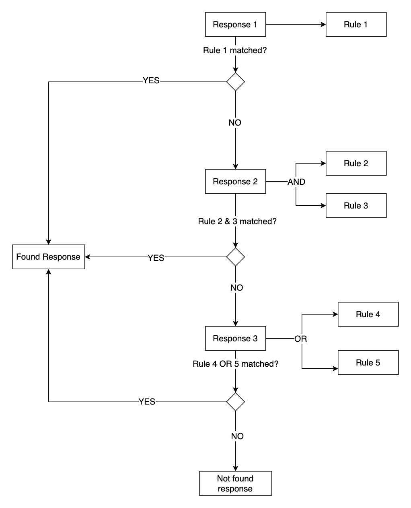

# Request rules

Each route can have multiple responses. For each response, we can setup a set of rules so that the response can only be served when the rules are matched. Rules are interpreted with OR or AND logical operator.



## Route parameter rule

In below example, the request is matched only when the URL is `GET /hello/john`.

```yaml title="route-param-rule.yaml"
name: param rule
port: 3000
routes:
    - path: /hello/:name
      method: GET
      responses:
        - body: "Hello John"
          rules:
            - target: route_param
              modifier: name
              value: john
              operator: equal
```

```bash
curl http://127.0.0.1:3000/hello/john
# Response: Hello John

curl http://127.0.0.1:3000/hello/something-else
# Response: No route matched
```

## Request header rule

In below example, the request is matched only when the HTTP request header `Authorization` is `my secret`

```yaml title="request-header-rule.yaml"
name: header rule
port: 3000
routes:
    - path: /hello
      method: GET
      responses:
        - body: "Secret revealed"
          rules:
            - target: header
              modifier: Authorization
              value: my secret
              operator: equal
```

```bash
curl -H "Authorization: my secret"  http://127.0.0.1:3000/hello
# Response: Secret revealed

curl http://127.0.0.1:3000/hello
# Response: No route matched
```

## Request cookie rule

In below example, the request is matched only when the HTTP request cookie `username` is `mockingio`

```yaml title="request-header-rule.yaml"
name: cookie rule
port: 3000
routes:
    - path: /hello
      method: GET
      responses:
        - body: "Cookie found"
          rules:
            - target: cookie
              modifier: username
              value: mockingio
              operator: equal
```

```bash
curl --cookie "username=mockingio"  http://127.0.0.1:3000/hello
# Response: Cookie found

curl http://127.0.0.1:3000/hello
# Response: No route matched
```

## Query param rule

In below example, the request is matched only when the query param `name` is `mockingio`

```yaml title="query-param-rule.yaml"
name: query param rule
port: 3000
routes:
    - path: /hello
      method: GET
      responses:
        - body: "Hello John"
          rules:
            - target: query_param
              modifier: name
              value: mockingio
              operator: equal
```

```bash
curl  http://127.0.0.1:3000/hello?name=mockingio
# Response: Hello John

curl http://127.0.0.1:3000/hello
# Response: No route matched
```

## Request body rule

In below example, the request is matched only when the request body is JSON and have the `address.suburb` is Melbourne

```yaml title="query-param-rule.yaml"
name: query param rule
port: 3000
routes:
    - path: /hello
      method: POST
      responses:
        - body: "Hello World"
          rules:
            - target: body
              modifier: address.suburb
              value: Melbourne
              operator: equal
```

```bash
curl --location --request POST 'http://127.0.0.1:3000/hello' \
--header 'Content-Type: application/json' \
--data-raw '{
    "address": {
        "suburb": "Melbourne"
    }
}'
# Response: Hello World

curl http://127.0.0.1:3000/hello
# Response: No route matched
```

## Request number rule

In below example, the request is matched only when the same request has been called for 3 times.

```yaml title="request-number-rule.yaml"
name: request number rule
port: 3000
routes:
    - path: /hello
      method: GET
      responses:
        - body: "This is 3rd call"
          rules:
            - target: request_number
              value: 3
              operator: equal
```

```bash
# first call
curl  http://127.0.0.1:3000/hello
#Response: No route matche

# second call
curl  http://127.0.0.1:3000/hello
#Response: No route matche

# third call
curl  http://127.0.0.1:3000/hello
#Response: This is 3rd call
```
